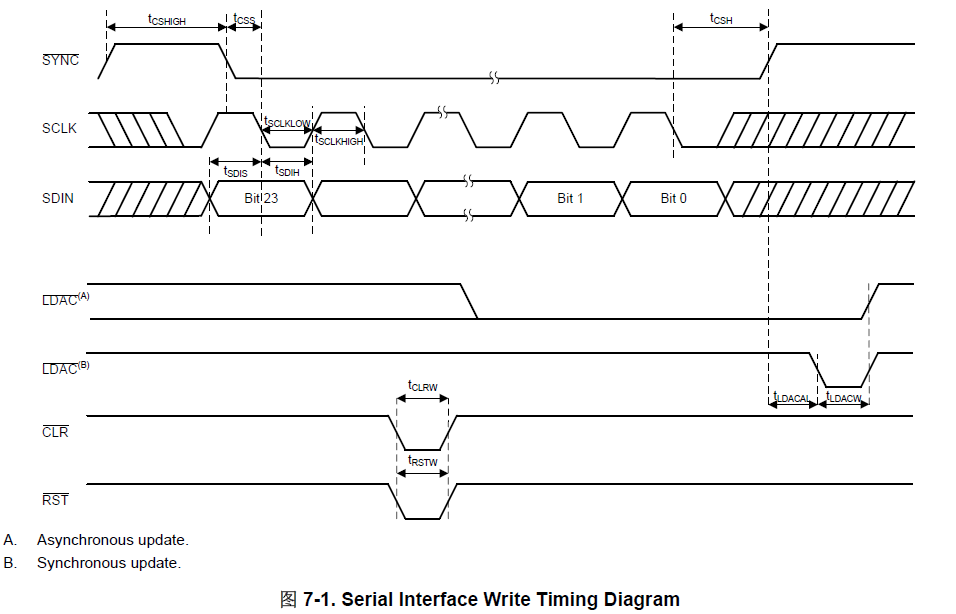
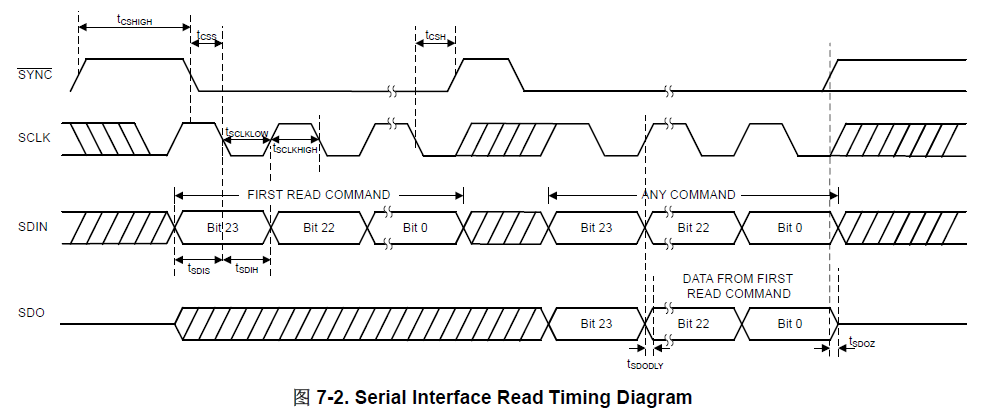
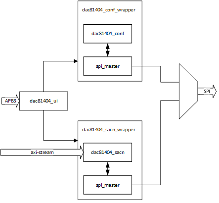
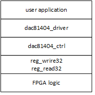

# DAC81404 应用指南

## 时序

1. 写时序

   

2. 读时序

   

3. SDI 数据格式

   | bit   | 位域    | 说明                          |
   | ----- | ------- | ----------------------------- |
   | 23    | RW      | 读写标志                      |
   | 22    | X       | 不关心                        |
   | 21-16 | A[5:0]  | 6 位寄存器地址                |
   | 15-0  | D[15:0] | 16 位写数据，为读命令时不关心 |

4. SDO 数据格式

   读操作需要两个传输周期完成，在第二次传输时 SDO 上输出上次传输周期的读取命令和读出的数据

SPI 时钟速率最高位 50MHz

不启用 CRC 时一次读写传输周期最少需要 3 字节，启用时最少需要 4 字节，多余的数据会被丢弃

## 寄存器

|            | 寄存器             | 地址      | 说明                             |
| ---------- | ------------------ | --------- | -------------------------------- |
| NO_OP      | 空操作             | 0x00      | 无操作                           |
| DEVICEID   | ID 寄存器          | 0x01      | 设备 ID 和版本号，高 14 位为 ID  |
| STATUS     | 状态寄存器         | 0x02      | 温度警告、DAC 繁忙、CRC 错误状态 |
| SPICONFIG  | 配置寄存器         | 0x03      | 设备接口及功能使能配置           |
| GENCONFIG  | 参考电压设置寄存器 | 0x04      | 设置参考电压源是否开启           |
| BRDCONFIG  | 广播使能寄存器     | 0x05      | 设置 DAC 通道是否接受广播数据    |
| SYNCCONFIG | 同步使能寄存器     | 0x06      | 设置 DAC 通道是否接受 LDAC 触发  |
| DACPWDWN   | 掉电控制寄存器     | 0x09      | 设置 DAC 通道是否启用            |
| DACRANGE   | 范围配置寄存器     | 0x0A      | 设置 DAC 通道输出范围            |
| TRIGGER    | 控制寄存器         | 0x0E      | 软件复位、清空、触发等           |
| BRDCAST    | 广播数据寄存器     | 0x0F      | 广播数据                         |
| DACx       | 通道数据寄存器     | 0x10-0x13 | DAC 通道数据                     |

## 一般编程顺序

1. 初始化 SPI

2. 硬件复位/软件复位

3. 读 DEVICEID 获取 ID 并校验

4. 写 SPICONFIG 使能器件特性

5. 写 DACPWDWN 关闭所有 DAC 通道

6. 写 GENCONFIG 启用或禁用内部参考源

7. 写 BRDCONFIG 设置 DAC 通道是否接受广播数据

8. 写 SYNCCONFIG 设置 DAC 通道是否接受 LDAC 触发

9. 写 DACRANGE 配置 DAC 通道输出范围

10. 写 DACPWDWN 开启 DAC 通道

11. 开始写 BRDCAST 或 DACx

## 参考 FPGA 程序

## 参考 C 驱动程序

